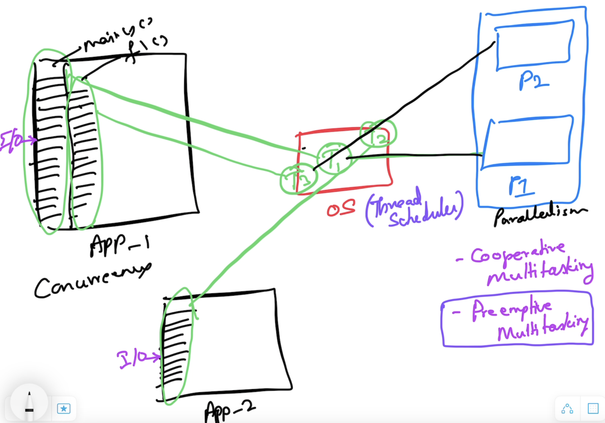
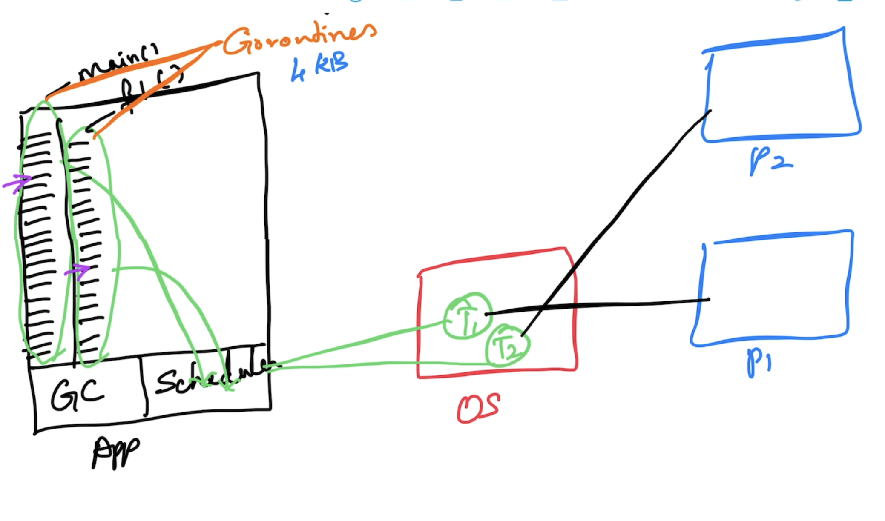

# Advanced Go

## Magesh Kuppan
- tkmagesh77@gmail.com

## Schedule
| What | When |
|------|------|
| Commence | 9:00 AM |
| Tea Break | 10:30 AM (20 mins) |
| Lunch Break | 12:30 PM (1 hr) |
| Tea Break | 3:00 PM (20 mins) |
| Wind up | 4:30 PM |

## Software Requirements
- Go Tools
- VS Code (or any editor)

## Methodology
- No powerpoints
- Code & Discuss
- No dedicated Q & A time

## Repository
- https://github.com/tkmagesh/Cisco-AdvGo-Jan-2025

## Prerequisites
- Data Types, Variables, Constants, iota
- Programming Constructs (if else, for, switch case)
- Functions
    - Higher Order Functions
    - Deferred Functions
- Errors
- Panic & Recovery
- Structs & Methods
    - Struct Composition
- Interfaces
- Modules & Packages

## Agenda
- Recap
- Concurrency
- Adv Concurreny Patterns
- Context
- Database programming choices
- HTTP Services
- GRPC Services
- Testing
- Micro benchmarking
- Profiling

## Modules & Packages
### Module
- Any code that need to versioned and deployed together
- Typically, a folder with go.mod file
- go.mod
    - manifest file for the module
    - name
        - typically, includes the complete repo path
    - go runtime version
    - dependencies
- Reference (https://go.dev/ref/mod)
#### Create a module
```shell
go mod init <module_name>
# ex:
go mod init github.com/tkmagesh/cisco-gofoundation-dec-2024/11-modularity-demo
```

#### Execute a module
```shell
go run .
```

#### Create a build
```shell
go build .
# OR
go build -o <binary_name> .
```

### Package
- Internal organization of code in a module
- Just folders
- Can be nested
- Scope can be defined at the package level

### Using OSS 
#### Add an OSS package
- By default, OSS packages are downloaded in the GOPATH/pkg folder
```shell
go get <name>
# ex:
go get github.com/fatih/color
```
#### Update the go.mod file references
```shell
go mod tidy
```
#### Only download the dependencies
```shell
go mod download
```
#### To localize the dependencies
```shell
go mod vendor
```

## Concurrency
### What is Concurrency?
- Design with more than one execution path
- Typically achieved using OS Threads
    - OS Thread ~ 2MB



### Go Concurrency (Managed Concurrency)
- Built in scheduler
- Concurrent operations are represented as "go routines"
- goroutines are lightweight (4 KB)


### WaitGroups
- sync.WaitGroup
- semaphore based counter
- has the ability to block the execution of a function until the counter becomes 0

### Data Race detection
```shell
go run -race <program.go>
# OR
go build -race <program.go>
```

### Channels
- data type designed to enable communication between goroutines
#### Declaration
```go
var <var_name> chan <data_type>
// ex:
var ch chan int
```
#### Initialization
```go
<var_name> = make(chan <data_type>)
// ex:
ch = make(chan int)
```
#### Declaration & Initialization
```go
var ch chan int = make(chan int)
// OR
var ch = make(chan int) // type inference
// OR
ch := make(chan int)
```
#### Channel Operation
- Using the channel operator ( <- )
##### Send Operation
```go
<ch_var_name> <- <data>
// ex:
ch <- 100
```
##### Receive Operation
```go
<- <ch_var_name>
// ex:
data := <-ch
```
##### Channel Behavior


## Context
- Cancel propagation
- Cancellation Strategies
    - programmatic cancellation
    - time based cancellation
        - relative time
        - absolute time
- Creating a Context
    - context.Background()
        - Usually the root context
        - Meant to be used as a parent for creating context
        - Non cancellable
    - context.WithCancel()
        - programmatic cancellation
    - context.WithTimeout()
        - relative time based cancellation (automatic & programmatic)
        - wrapper for context.WithDeadline()
    - context.WithDeadline()
        - absolute time based cancellation (automatic & programmatic)
    - context.WithValue()
        - Used for sharing data across context hierarchies
        - Non cancellable

## Database Programming
- Standard Library package (database/sql)
- High level extensions for the stdlib (sqlx)
- Code generators (sqlc)
    - https://docs.sqlc.dev/en/latest/index.html
- ORM (GORM)
- Query Builders

## GRPC
- Alternative to HTTP based restful services
- Apt for microservices communication
- Uses HTTP/2
- Communication Patterns
    - Request & Response
    - Server Streaming
    - Client Streaming
    - Bidirectional Streaming
- Protocol Buffers for serialization
    - Allows for sharing the schema well in advance
    - Enables ONLY the data (without any annotation) for communication
- Multilanguage support
    - Go
    - .Net
    - JS
    - Java
    - C++
### Steps
    - Define data contracts (protobuf)
    - Define service contract (protobuf)
        - Define operation contracts (protobuf)
    - Generate the Proxy & Stub
    - Implement the service and host it using the Stub
    - Create a client that communicates to the sevice using the Proxy

### Tools Installation 
    1. Protocol Buffers Compiler (protoc tool)
        Windows:
            Download the file, extract and keep in a folder (PATH) accessble through the command line
            https://github.com/protocolbuffers/protobuf/releases/download/v24.4/protoc-24.4-win64.zip
        Mac:
            brew install protobuf

        Verification:
            protoc --version

    2. Go plugins (installed in the GOPATH/bin folder)
        go install google.golang.org/protobuf/cmd/protoc-gen-go@v1.28
        go install google.golang.org/grpc/cmd/protoc-gen-go-grpc@v1.2

        Verification:
            the binaries (protoc-gen-go, protoc-gen-go-grpc) must be present in $GOPATH/bin folder
    

## Testing
- Test Framework
    - "testing" package
- Test Runner
    - "go" tool

